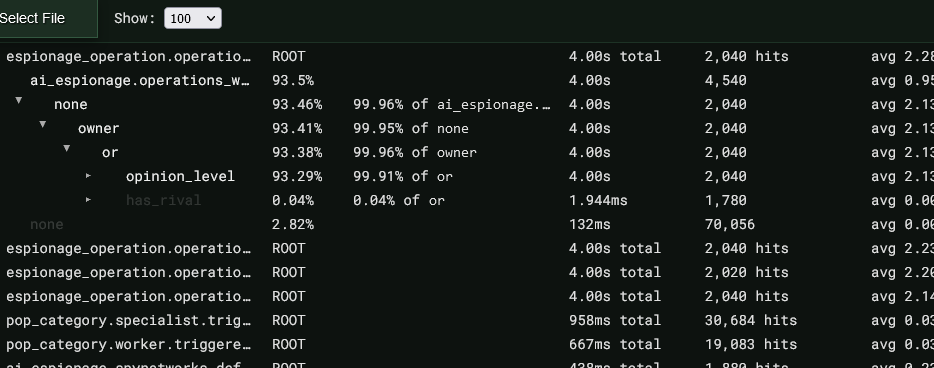

# Stellaris Profile Viewer

 

## [https://abrenneke.github.io/stellaris-profile-viewer](https://abrenneke.github.io/stellaris-profile-viewer/)

The Stellaris Profile Viewer is a tool that helps you analyze the performance of your Stellaris mods by visualizing the script profiling log file generated by the game's script profiler. This log file contains information about the execution time of various scripts and can help pinpoint which mod or script is causing lag or performance issues. The tool generates a breakdown of your code's performance, including detailed statistics on execution time, parent-child relationships, and more.
Usage

## Getting Started

1. Clone or download this repository to your local machine.
2. Install the serve package globally by running npm install -g serve in your terminal.
3. In the terminal, navigate to the project directory and run serve.
4. In your web browser, go to http://localhost:3000.
5. Select your script_profiling.log file and wait for the tool to finish.

## Contributing

Stellaris Profile Viewer is an open-source project and we welcome contributions from anyone! Whether you're a seasoned developer or just getting started, there are many ways to get involved and help improve the project.

Here are some ways you can contribute:

- Report bugs or issues: If you find a bug or issue with the tool, please let us know by creating an issue in the GitHub repository.
- Improve the documentation: If you notice any mistakes or missing information in the documentation, feel free to submit a pull request with your changes.
- Contribute code: If you're interested in contributing code to the project, take a look at the open issues and see if there's anything that interests you. We also welcome new feature ideas and improvements to existing functionality.
- Spread the word: If you find the tool useful, please help spread the word by sharing it with your friends and colleagues.

If you have any questions or need help getting started, please don't hesitate to reach out. We're here to help and happy to have you involved in the project!

## Implementation

The Stellaris Profile Viewer is built entirely in vanilla JavaScript, with no external libraries or frameworks. The JS is split into three main files:

- `index.js` - This is the entry point of the app and handles all user input, including file selection, parsing, and rendering.
- `parser.js` - This file contains all the logic for parsing the script profiling log file generated by the game's script profiler. It extracts and transforms the relevant data into a tree structure that is easier to work with.
- `rendering.js` - This file contains all the logic for rendering the parsed profile into an interactive table. It uses DOM manipulation to create and update rows as the user interacts with the table.
- `worker.js` - Web worker that handles the actual parsing of the log file in a separate thread. Improves the responsiveness of the UI while the log file is being processed.

## License

Stellaris Profile Viewer is licensed under the Unlicense, meaning it is released into the public domain where applicable. You may use, copy, and modify the tool for any purpose without restrictions or attribution.

## Acknowledgments

Full disclosure, this app was created with heavy assistance from ChatGPT, an AI language model developed by OpenAI. Mostly to just experiment with AI-assisted development.

## Code Quality

Questionable. It's AI generated after all.
